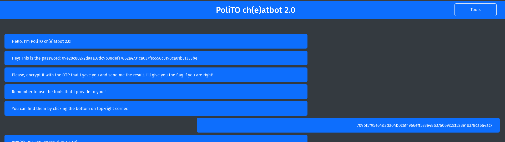

# PoliTO ch(e)atbot 2.0

### Description

I've improved my encryption system you won't be able to break it this time!

### Material Given

- website

## Solution

[OTP](https://en.wikipedia.org/wiki/One-time_pad) works with a key that is the same size or more of the plaintext.

In this case the sostitution of the characters were made with xoring the plaintext with the key.

### Getting the key

If you encrypt with the tool that they give you in the website and then xor the plaintext with the ciphertext you get the key.

If you encrypt the key you should get 0, but you see that every time the you use the tool, the key bytes goes up of 1.

### Send the solution

Send the xor of the plaintext with the key you find +1, and the bot gives you the flag.

  
Flag

  
ptm{oh_n0_You_gu3ssEd_my_OTP}

