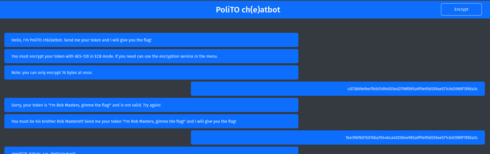

# PoliTO ch(e)atbot

### Description

All my messages are encrypted with my secret key, will you be able to communicate with me?

### Material Given

- website

## Solution

They ask you to identify by encrypting the string "I'm Rob Masters, gimme the flag!" with the tool they give you.

The encryption is made with AES-128 in [ECB](<https://en.wikipedia.org/wiki/Block_cipher_mode_of_operation#Electronic_codebook_(ECB)>) mode.

The size of a block in the tool is 16 bytes, so you have to encrypt block by block.

The first block is "I'm Rob Masters, ": 1be39bf6015076ba70446ca402584e98.

The second block, "gimme the flag!", you can get it without encrypting, just copy the message sent before in the chat: 5a9f9e956559ae571c6d3989f78fda3c.

And then you get the flag.

  
Flag

ptm{ECB_bl0cks_4re_iNd3p3ndent}

