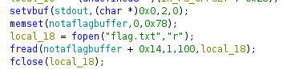
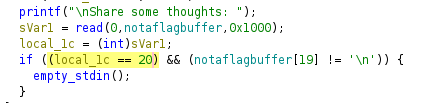
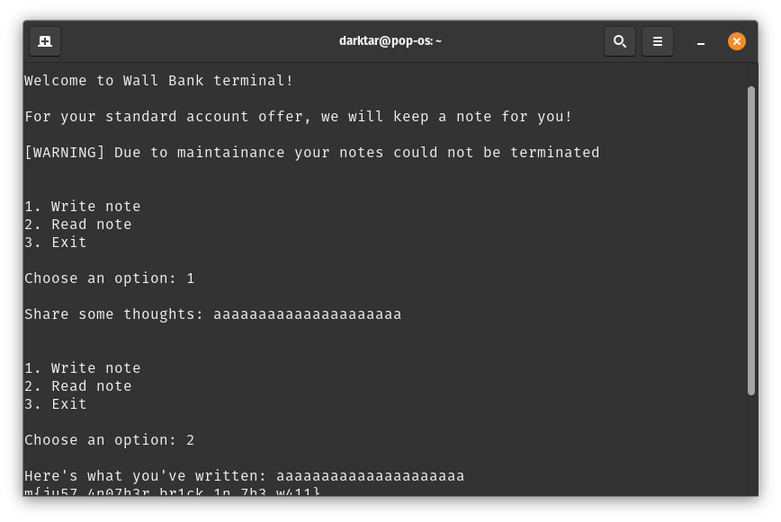

# The Wall

### Description

A friend of mine told me about a peculiar bank. You gotta give it a try for me.

### Material Given

ELF file

## Solution

### Analize

With a disassembler (I used [ghidra](https://ghidra-sre.org/)) analize the file and try to get the code.

The flag is stored into the string **notaflagbuffer** with an offset of 20.

Seeing this you can understand that by sending 21 characters you can get the flag without the firsts character.

### Getting the flag

Exec it and send 21 chars and get the flag

  
Flag

ptm{ju57_4n07h3r_br1ck_1n_7h3_w411}

