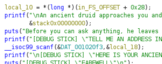

# Polito Pay 2 Win

### Description

PoliTO can be quite challenging. To pass this exam session, you'll need to earn a significant number of ECTS. Do you think you can manage to do it?

### Material Given

- tcp connection
- .zip file

## Solution

### Analize

With a disassembler (I used [ghidra](https://ghidra-sre.org/)) analize the file and try to get the code.

In this code you can see that the program print the address of the first element of the stack and then ask the user to give him an address.

Then analizing the program with a debugger (I used [pwngdb](https://github.com/pwndbg/pwndbg)) you see that the flag is stored with an offset of 8.

### Get the flag

Knowing this you can solve this challenge.

  
Flag

ptm{n34r3r_7h4n_3xp3c73d}

