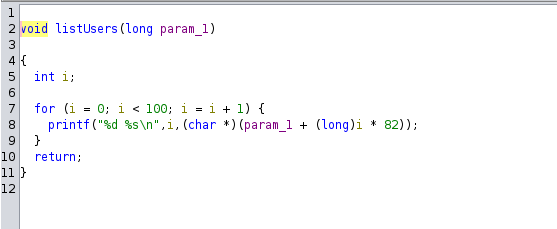
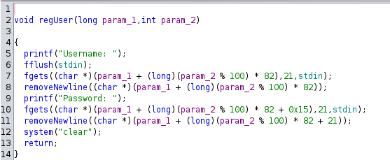
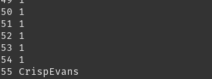
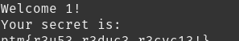

# OURsql

### Description

Check out OUR new database!

### Material Given

- tcp connection
- .zip file

## Solution

In the .zip file there is a program that you need to run with the db.txt file.

In the db.txt we can see that a user has a secret which is the flag.

### Analize the executable

If you look at the executable you see that the max number of people in the database is 100.

When you list the user the code looks like this:

The regUser function create a "new" account in the position of the number of user mod 100:

So if you create the 101th account it will go in position 1 and so on.

We can confirm that:

Then we see that it does change the secret of the account of that position so we can get the flag:

  
Flag

ptm{r3u53_r3duc3_r3cyc13!}

