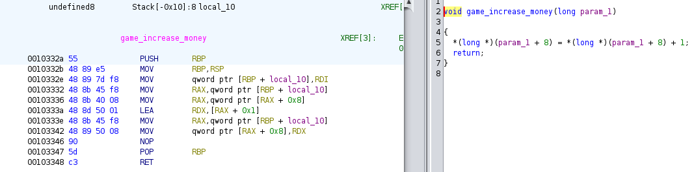
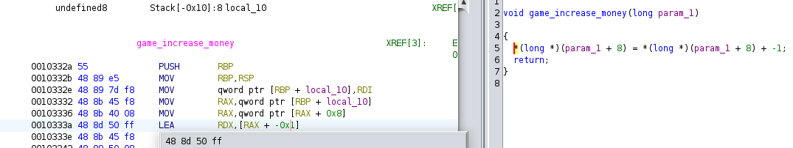

# Polito Pay 2 Win

### Description

PoliTO can be quite challenging. To pass this exam session, you'll need to earn a significant number of ECTS. Do you think you can manage to do it?

### Material Given

- .zip file

## Unintened solution

While playing the game you see that in the market you can buy an unknown item that is really pricy.

By looking at the market.py you can find the flag.

## Solution

### Analize the .so file

You see a function that increase in game money without any other checks:

We can manipolate to get a big quantity of money by simply changing the sign of the value:

Now while playing if we get a coin we will get a huge amount of money cuz unsigned value = -1.

Then in the market you just have to buy the unknown item to get the flag.

  
Flag

ptm{p4tch1ng_3xecut4bl3s_1s_fun}

