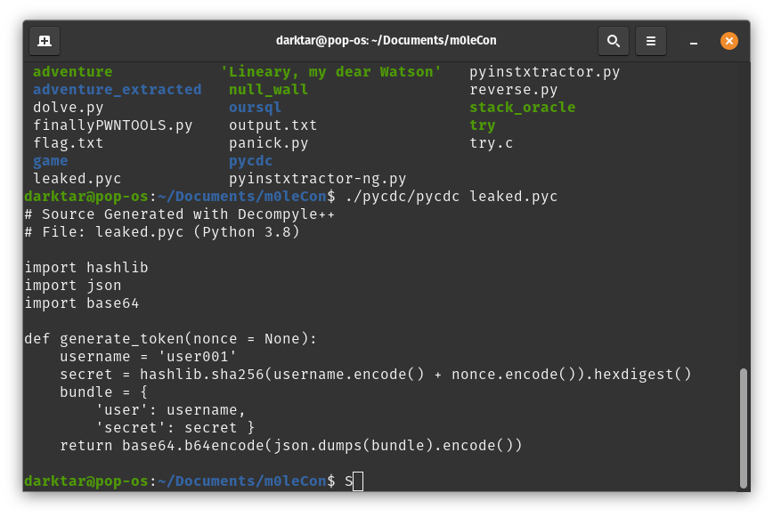

# SecureAccess

### Description

Alright choom we've got a gig for you.
Our best netrunners managed to leak a fragment of code from an authentication daemon.
Seems it was built using AIs from beyond the blackwall, out of reach from anyone except the best.
Will ya be able to log in as admin?

### Material Given

- .pyc file
- website

## Solution

### Disassemble and decompile the file .pyc

I used the tool [pycdc](https://github.com/zrax/pycdc) and got:

### Login

With this code you know the username and you are able to calculate the access token by using the string that they give you as nonce:

  
Flag

ptm{m4yb3_7he_A1s_4r3_n0t_th4t_5m4r7}

